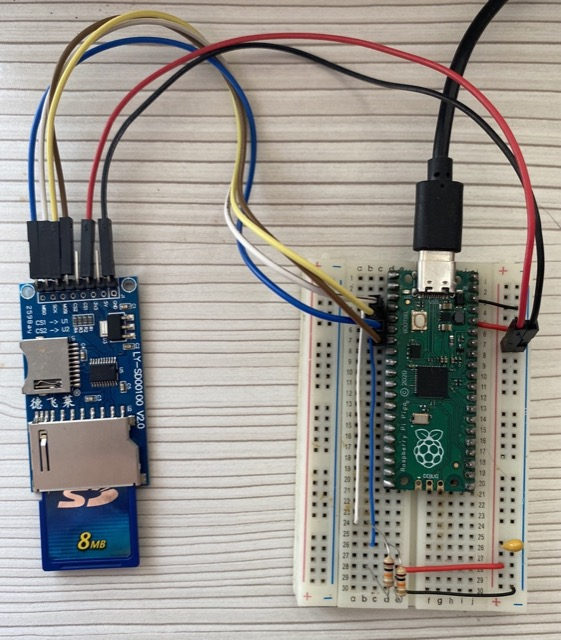

# Pi-Pico-FatFs-Spi-SD

## Raspberry Pi Pico SD Card Example (C SDK)

This project is a simple example of interfacing an **SD card with Raspberry Pi Pico** using the **C SDK**.  
It demonstrates how to initialize the SD card over SPI and perform basic file operations with the FatFS library.

The project was adapted and inspired by the following resources:

- [FatFs - Generic FAT Filesystem Module](http://elm-chan.org/fsw/ff/00index_e.html)
- [Random Nerd Tutorials – Raspberry Pi Pico: MicroSD Card with MicroPython](https://randomnerdtutorials.com/raspberry-pi-pico-microsd-card-micropython/)  
- [carlk3/no-OS-FatFS-SD-SPI-RPi-Pico](https://github.com/carlk3/no-OS-FatFS-SD-SPI-RPi-Pico)

---

## 📂 Project Structure
- `src/` — C source files for SD card initialization and FatFS usage  
- `include/` — header files  
- `CMakeLists.txt` — build configuration for CMake
- ‍`FatFs_SPI` - FatFs file system

---

## 🚀 Build and Flash
1. Set up the **Raspberry Pi Pico SDK** environment.  
   - Follow the official guide: [Getting started with Raspberry Pi Pico C/C++ SDK](https://datasheets.raspberrypi.com/pico/getting-started-with-pico.pdf)  
2. Clone this repository and initialize the project with CMake:  
   ```bash
   mkdir build
   cd build
   cmake ..
   make
3. Flash the generated `.uf2` file to your Pico board.

## Prerequisites:
* Raspberry Pi Pico
* A SD/Micro SD SPICard Board
* Breadoard and wires
* Raspberry Pi Pico C/C++ SDK
* (Optional) A Couple of ~10KΩ resistors for pull-ups
* (Optional) A capacitor for decoupling ~10uF
* Set your SPI-MISO-MOSI-SCK 




## Features:
* Support SD Cards V1 and V2
* Support long files name
* Support Persian and Arabic characters
* Support Unicode
* Supports Real Time Clock for maintaining file and directory time stamps
* Problem with 32GB Micro SD cards yet.

## Capabilities:
* Detect SD Cards and mount it as drive 0:
* Directory of SD Card
* Create and write a sample file with name hello_world.txt
* Read the content of file

## Debugging
* Monitor with a terminal applications such as puTTY in Windows
* Monitor with Screen command in Mac and linux such as
```bash
   screen /dev/tty.usbmodem14501 115200
```
* Failed to mount, the pi-pico led blinking fast
* After mount, the pi-pico led on 1 sec for writting file

## 🙌 Acknowledgements:

This project was made possible thanks to the excellent work of:

Carl K3 for the no-OS-FatFS-SD-SPI-RPi-Pico
 repository, which provides a robust FatFS + SPI SD card implementation in C.

FatFs - Generic FAT Filesystem Module

Random Nerd Tutorials (Rui Santos and Sara Santos) for their accessible MicroPython example and tutorial.
If you are looking for more advanced features or direct MicroPython support, please check their original work.

## 📜 License:

This project is released under the MIT License.

Please note:

The tutorial and sample code from Random Nerd Tutorials are for educational use, and full credit belongs to the authors.

The repository no-OS-FatFS-SD-SPI-RPi-Pico
 is licensed under MIT; make sure to follow its LICENSE terms when using their code.

This repository is distributed under the following licenses:

- **MIT License** — applies to the code written specifically for this repository.  
- **Apache License 2.0** — applies to portions of the code adapted from:  
  - [carlk3/no-OS-FatFS-SD-SPI-RPi-Pico](https://github.com/carlk3/no-OS-FatFS-SD-SPI-RPi-Pico)  
  - [Mbed OS SDBlockDevice](https://os.mbed.com/docs/mbed-os/v5.15/apis/sdblockdevice.html)  
